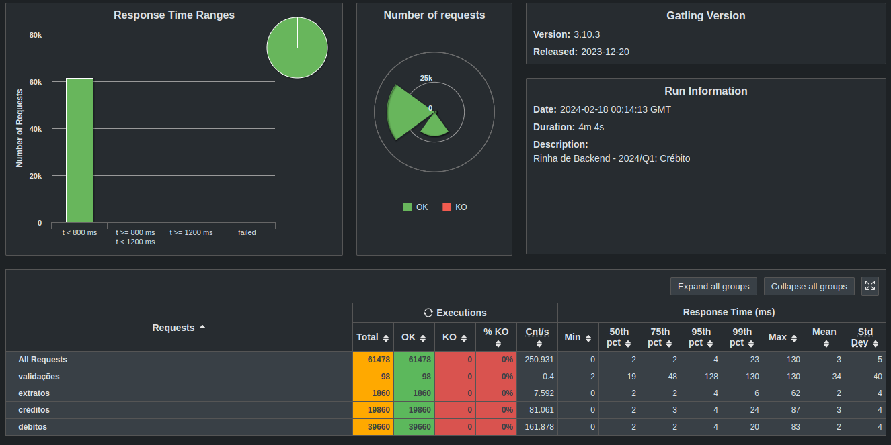

# Submissão Vine Boneto

[Rinha de Backend 2024/Q1](https://github.com/zanfranceschi/rinha-de-backend-2024-q1)

## Stack

- [NodeJS](https://nodejs.org/en)
- [Fasitfy](https://fastify.dev/)
- [Postgres](https://fastify.dev/)
- [Nginx](https://www.nginx.com/)

## Repositório

- [Link](https://github.com/vineboneto/rinha-backend-2024-q1)

## Pré-requisitos

- [Docker](https://www.docker.com/)
- [Docker Compose](https://docs.docker.com/compose/)

## Instalação

```bash
docker compose up -d
pnpm install
```

## Executar (Desenvolvimento)

```bash
pnpm run dev
```

## Testes

```bash
pnpm run test
```

## Resultados


